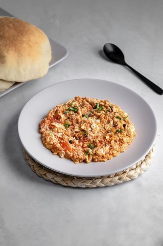
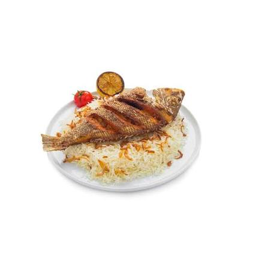
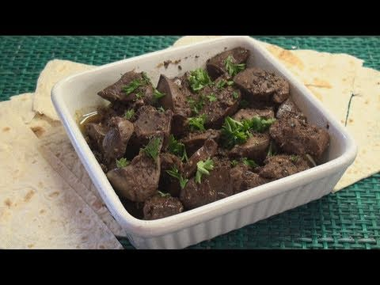
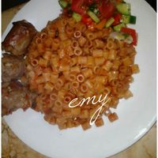

# Bahraini Food Explorer

Detect and classify traditional Bahraini dishes in photos and live video with a
two-stage YOLO + Vision Transformer pipeline.

[](https://colab.research.google.com/drive/1UKzkRAD-gbk1ZHPQIh5-sA63TEj_qK3N?usp=sharing)
[](https://bahrain-food-classifier.streamlit.app/)

## Try It

| Link | Description |
|---|---|
| [Streamlit App](https://bahrain-food-classifier.streamlit.app/) | Upload, camera, and live-streaming demo |
| [Colab Notebook](https://colab.research.google.com/drive/1UKzkRAD-gbk1ZHPQIh5-sA63TEj_qK3N?usp=sharing) | Interactive training and detection notebook |
| Gradio (this repo) | Also deployed as a Hugging Face Space — run `gradio_app.py` |

## How It Works

1. **YOLO** (`models/best.pt`) locates food objects and draws boxes.
2. **ViT classifier** (`models/big_model.pt`, ViT-B/16 fine-tuned with a linear
   probe) identifies the dish inside each detection.
3. Two modes: YOLO-only detection, or two-stage detection + classification.

## Classes

balaleet · egg_tomato · fish · gaimat · halwa · karak · liver · ma3krona ·
nakhaj · samboosa · tikka

## Sample Photos

| | | | |
|---|---|---|---|
| balaleet<br> | egg_tomato<br> | fish<br> | gaimat<br> |
| halwa<br> | karak<br> | liver<br> | ma3krona<br> |
| nakhaj<br> | samboosa<br> | tikka<br> | |

## Run Locally

```bash
pip install -r requirements.txt
```

```bash
# Streamlit app (camera, upload, live streaming)
streamlit run Bahfood_app.py

# Gradio app (Hugging Face Space)
python gradio_app.py
```

Place `models/best.pt` (YOLO) and optionally `models/big_model.pt` (ViT
classifier) in `models/`. The dataset lives in `data/<class>/`.

## Training

`train_big_model.py` fine-tunes the classifier: it loads a ViT-B/16 backbone,
replaces the head with an 11-class linear layer, trains a linear probe, then
optionally unfreezes the last blocks. See
[MODEL_REPORT.md](MODEL_REPORT.md) for the full model investigation.

## License

[MIT](LICENSE)
